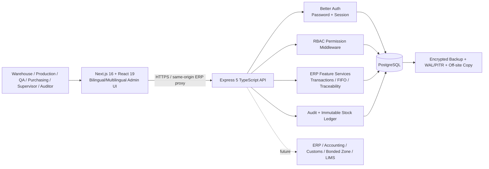

# Tasks 6, 8 and 9 - Architecture, Disaster Recovery and Implementation Approach

## System architecture

### Technology selection

- **Next.js/React/TypeScript:** component-based admin UI, locale routing, server/client separation and a strong shared type ecosystem.
- **Express/TypeScript:** explicit API boundary and middleware model for authentication, authorization and error handling.
- **PostgreSQL:** relational integrity, transactions, row locking, window functions and strong reporting capabilities required by inventory systems.
- **Drizzle ORM:** typed schema/query construction while preserving access to SQL when transaction/reporting logic needs it.
- **Better Auth:** password hashing and session lifecycle without implementing authentication primitives from scratch.

### Maintainability

The ERP backend is split by feature modules (routes/controller/service/repository/schema where complexity warrants it). Frontend ERP requests are centralized in API service files, while shared selects such as Supplier Select are reusable. Business logic is kept out of generic UI components.

### Scalability

The frontend/API can scale horizontally because persistent business state lives in PostgreSQL. Add a managed connection pool, read replicas/reporting replica, cache for stable reference data, background workers for long-running integration jobs, and object storage for documents when production load requires them. Inventory posting continues to use database transactions/locking rather than relying on process memory.

### Security

Authentication and permission checks occur server-side. Zod validates payloads, Drizzle parameterizes SQL, and stock posting is transactional. Sensitive configuration remains environment-based. Audit and ledger evidence is append-only; mutable master data can use soft delete.

### Operating cost

The prototype runs locally at no hosting cost. A small production deployment can start with one frontend/API service and managed PostgreSQL, then scale only when transaction volume or availability requirements justify extra replicas/workers. This avoids premature infrastructure cost.

### Future integration readiness

Expose versioned integration endpoints/events around master-data sync, goods receipt, production issue/output, delivery and stock reconciliation. Use stable business document numbers and idempotency keys for ERP/Customs interfaces. Keep Customs-specific declaration/reporting logic outside the core inventory transaction service so regulatory changes do not destabilize stock accounting.

## Backup and Disaster Recovery

Recommended practical production approach:

1. **Daily backup:** nightly encrypted PostgreSQL base/logical backup.
2. **Incremental/log backup:** continuous WAL archiving/PITR where supported.
3. **Off-site copy:** replicate backup to a separate account/region with restricted credentials.
4. **Encryption:** TLS in transit; provider/storage encryption at rest; protect backup keys separately.
5. **Retention:** example policy - daily 14 days, weekly 8 weeks, monthly 12 months; confirm with business/regulatory requirements.
6. **Restore testing:** automated verification plus quarterly full restore drill and reconciliation of stock/ledger/audit counts.
7. **Server failure:** rebuild stateless app service, restore/attach database, run the recorded migration version, then health-check login and critical inventory queries.
8. **Ransomware:** immutable/versioned off-site backups, least-privilege backup credentials and restore into a clean isolated environment.
9. **Prototype target RPO/RTO:** RPO <= 24 hours and RTO <= 4 hours until the business sets stricter objectives. With WAL/PITR a production RPO can be reduced substantially.

## Implementation approach

### 1. Requirements gathering

Run short workshops with Warehouse, Production, QA, Purchasing, Finance and Management. For each process capture owner, document number, mandatory fields, status/approval, stock impact, exception/reversal path, report needs and existing Excel/source systems. Confirm terminology and units before migration.

### 2. Excel migration and duplicate-master prevention

- Define a staging template for materials, suppliers/customers, opening batches and balances.
- Normalize codes, whitespace, units and dates before loading.
- Validate required columns and foreign-key references before commit.
- Detect duplicate business codes and duplicate normalized names; send conflicts to a review list instead of silently merging.
- Load to staging first, reconcile row counts/totals, then promote in one controlled migration window.

### 3. UAT and user training

Prepare role-based UAT scenarios: receive material, release/reject quality, issue FIFO stock, verify current stock, trace batch, reverse an error and deliver finished goods. Record expected vs actual result and sign-off. Train each user group only on its permitted workflow, plus common error/recovery steps.

### 4. Recommended implementation phases

1. Master data + users/RBAC + warehouse/location.
2. Goods Receipt + QA + Current Stock + Ledger.
3. Material Issue + Production Order + FIFO + traceability/reconciliation.
4. Finished Goods Receipt + Sales/Delivery.
5. Reporting, backup/DR drills and monitoring.
6. ERP/accounting/Customs/Bonded Zone integration after core inventory accuracy is accepted.

### 5. Bonded Zone / ERP / Customs future development

Add integration mapping for customs-relevant material codes, bonded warehouses, import/export document references and reconciliation reports. Use idempotent integration messages, integration audit logs and a retry/dead-letter mechanism. Do not allow an external integration failure to create a half-posted stock transaction.
