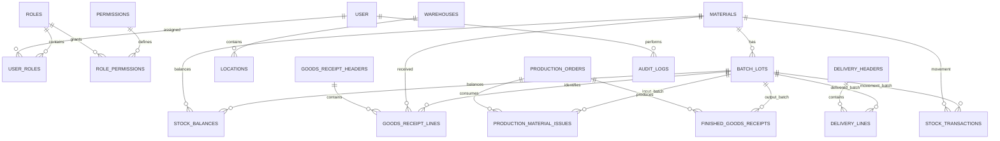
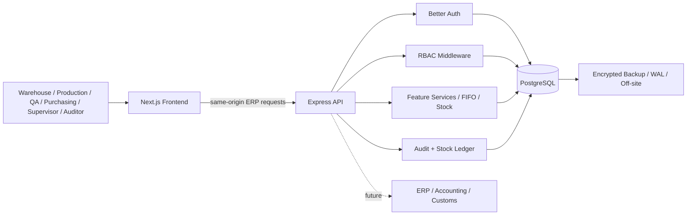

# FKA ERP Technical Assessment Report

**Assessment:** IT Inventory System Developer - PT French Korean Aromatics  
**Prototype:** FKA ERP Mini Prototype  
**Database:** PostgreSQL  
**Frontend:** Next.js / React / TypeScript  
**Backend:** Express / TypeScript / Drizzle ORM  
**Authentication:** Better Auth  
**Scope:** inventory and manufacturing transaction core, with additional purchasing, production, quality, delivery, RBAC and audit prototype features.

---

## 1. Business Process Analysis

The full process analysed for the assessment is:

```text
Purchase Requisition
-> Purchase Order
-> Goods Receipt
-> Incoming Quality Check
-> Raw Material Warehouse
-> Material Issue
-> Production Order
-> Manufacturing Process
-> Finished Goods Receipt
-> Finished Goods Warehouse
-> Sales / Delivery Order
-> Customer Delivery
```

The detailed responsibility, document, inventory impact, traceability, approval/validation, quality status and future Customs/ERP control points are documented in **`docs/PROCESS_FLOW.md`**.

### Key flow summary

| Stage | Main owner | Inventory effect | Main control |
|---|---|---:|---|
| Purchase Requisition | Production / Purchasing | None | Material, unit, quantity and requirement validation |
| Purchase Order | Purchasing | None | Active supplier, unique document and status |
| Goods Receipt | Warehouse | Increase on-hand in quarantine | PO/material/unit/qty validation, batch and duplicate prevention |
| Incoming Quality | QA / Approver | No quantity change | Release or reject receipt batch |
| Raw Material Warehouse | Warehouse | Available stock after release | Material + batch + warehouse + location balance |
| Material Issue | Warehouse | Decrease raw material | Production-order link, FIFO/selected batch, no negative stock |
| Production Order | Production | None at creation | Planned quantity/BOM/status validation |
| Manufacturing | Production | Consumption already recorded by issue | Exact input batches tied to production order |
| Finished Goods Receipt | Production / Warehouse | Increase FG | Production order + output batch + quantity validation |
| FG Warehouse | Warehouse | Holds deliverable FG | FG balance by batch/location |
| Sales / Delivery Order | Sales / Logistics | Reservation may reduce availability | Customer and stock availability validation |
| Customer Delivery | Logistics / Warehouse | Decrease FG | Exact delivered batch, no negative stock, unique delivery |

### Assumptions

1. Quantities use three decimal places and must be positive.
2. Default demo storage is used if a transaction does not explicitly select another warehouse/location.
3. A batch number is unique within a material.
4. Newly received raw material is quarantined until QA release.
5. Only eligible/released stock is consumed by production or delivery.
6. Posted stock movements and audit records are append-only. Corrections use a reversal/counter-entry with reason.
7. Mutable master/business data may use soft delete so historical transaction references remain traceable.
8. Customs/Bonded Zone, costing and external ERP/accounting integrations are treated as integration boundaries, not full production integrations in this prototype.

---

## 2. Database Design and ERD



### Database design characteristics

- **Multiple batches per item:** one material can have many `batch_lots`.
- **Multiple transaction lines:** Goods Receipt and Delivery use header/detail tables.
- **Several input batches per production order:** multiple `production_material_issues` rows can reference the same production order with different batch IDs.
- **Unique transaction numbers:** receipt/ledger/delivery document numbers have uniqueness constraints where applicable.
- **Raw material -> finished goods traceability:** input and output rows share `production_order_id`, allowing two-way queries.
- **Current balance separated from immutable ledger:** `stock_balances` supports fast operational reads while `stock_transactions` preserves movement history.
- **Audit evidence:** `audit_logs` records actor/action/entity and optional before/after JSON.
- **RBAC:** many-to-many `user_roles` and `role_permissions` allow role assignment without hard-coding permissions into UI pages.

A detailed table-level dictionary containing primary keys, foreign keys, mandatory/optional fields and purpose is included in **`docs/DATA_DICTIONARY.md`**. The executable source of truth remains **`erp-api/src/db/schema.ts`**.

---

## 3. SQL Queries

**SQL dialect: PostgreSQL.**

All five executable/logically complete assessment queries are provided in **`docs/ASSESSMENT_SQL.sql`**:

### 3.1 Current Stock

Returns Rose Extract (`RM-001`) balance grouped by batch, including material, batch, expiry, quantity and unit.

```sql
SELECT m.code, m.name, bl.batch_number, bl.expiry_date,
       SUM(sb.quantity_on_hand) AS quantity, sb.unit
FROM stock_balances sb
JOIN materials m ON m.code = sb.material_code
JOIN batch_lots bl ON bl.id = sb.batch_lot_id
WHERE m.code = 'RM-001'
GROUP BY m.code, m.name, bl.batch_number, bl.expiry_date, sb.unit, bl.received_at
ORDER BY bl.received_at, bl.batch_number;
```

### 3.2 Stock Ledger

Returns all Alcohol (`RM-002`) movements in August 2026, including quantity in/out and a window-function running balance. See `ASSESSMENT_SQL.sql` for the complete query.

### 3.3 Expiring Materials

Accepts a supplied report date and returns batches with positive on-hand stock whose expiry falls within the next 90 days.

### 3.4 Traceability

Two queries are provided:

- finished-goods batch -> all raw-material batches used;
- raw-material batch -> all finished-goods batches that consumed it.

The join path is `finished_goods_receipts -> production_orders -> production_material_issues`.

### 3.5 Reconciliation

A `FULL OUTER JOIN` compares ledger-derived quantity (`SUM(quantity_in - quantity_out)`) against `stock_balances.quantity_on_hand` by material, batch, warehouse, location and unit. The query returns discrepancies only.

---

## 4. FIFO Allocation and Transaction Safety

Assessment simulation stock:

| Batch | Receipt date | Available |
|---|---|---:|
| AL-26001 | 1 Aug 2026 | 40 L |
| AL-26002 | 10 Aug 2026 | 80 L |

For a request of **50 L Alcohol**, FIFO allocates:

```text
AL-26001 -> use 40 L -> balance 0 L
AL-26002 -> use 10 L -> balance 70 L
```

### Transaction-safety strategy

1. Begin PostgreSQL transaction.
2. Resolve production order/material and reject invalid status/unit.
3. Read eligible released balances ordered by oldest `batch_lots.received_at`.
4. Lock selected stock rows with `FOR UPDATE` before changing quantities.
5. Sum available stock and reject the complete request if it is insufficient.
6. Allocate oldest batch first until requested quantity is satisfied.
7. Update `stock_balances` and write `production_material_issues` plus immutable `stock_transactions` in the same transaction.
8. Write audit evidence.
9. Commit only after every step succeeds; any exception rolls the full transaction back.

### Risks addressed

- **Insufficient stock:** pre-check total eligible stock before commit.
- **Negative stock:** update only locked rows after availability validation.
- **Duplicate submission:** unique document numbers and idempotent/duplicate checks where posting flows support them.
- **Partial update:** stock, issue lines and ledger are written in one DB transaction.
- **Concurrent consumption:** row-level locking prevents two sessions from spending the same balance simultaneously.

---

## 5. Mini Web Prototype

The mandatory assessment flow is implemented:

```text
Goods Receipt -> Material Issue -> Current Stock -> Stock Ledger
```

Mandatory features and implementation status:

| Mandatory feature | Status | Main endpoint |
|---|---|---|
| Material Master | Implemented | `GET/POST/PUT/DELETE /api/erp/materials` |
| Goods Receipt Input | Implemented | `POST /api/erp/stock/goods-receipts` |
| Material Issue Input | Implemented | `POST /api/erp/stock/material-issues` |
| Batch/Lot Selection | Implemented | stock availability / receipt / issue data |
| Stock Availability Validation | Implemented | `GET /api/erp/stock/availability` |
| Balance by Item + Batch | Implemented | `GET /api/erp/stock/current-stock` |
| Stock Ledger | Implemented | `GET /api/erp/stock/ledger` |
| Persistent Database | Implemented | PostgreSQL via Drizzle ORM |

### Example API responses

Success concept:

```json
{
  "receiptId": "<uuid>",
  "receiptNumber": "GR-26006",
  "qualityStatus": "quarantine",
  "warehouseCode": "MAIN"
}
```

Validation/business error concept:

```json
{
  "code": "VALIDATION_ERROR",
  "message": "Request validation failed",
  "errors": [
    { "field": "quantity", "message": "Quantity must be greater than zero" }
  ]
}
```

Database-reference/schema errors are mapped to explicit error codes/messages rather than only returning a generic database violation message.

### Features beyond the mandatory prototype

The application also contains Purchase Requisition, Purchase Order, Incoming Quality Check, Production Order, Manufacturing/issue flow, Finished Goods Receipt, FG stock, Sales/Delivery, Customer Delivery, reservations, FIFO allocation, reversal, Business Partners, BOM, multilingual UI, Better Auth, RBAC and audit trail.

---

## 6. System Architecture



### Technology and operating considerations

- **Maintainability:** feature-based backend modules and centralized frontend API services reduce cross-module coupling.
- **Scalability:** frontend/API are stateless with persistent state in PostgreSQL; production can add connection pooling, reporting replicas, workers and caches as load grows.
- **Security:** server-side auth/permission validation, Zod input validation, parameterized Drizzle queries, transactional posting and immutable evidence.
- **Operating cost:** prototype runs locally; production can start with a small API/frontend service plus PostgreSQL and scale incrementally.
- **Integration readiness:** stable document numbers/reference IDs and explicit transaction boundaries can support idempotent ERP/accounting/Customs integration later.

The extended explanation is in **`docs/ARCHITECTURE_IMPLEMENTATION_DR.md`**.

---

## 7. Security and Role-Based Access Control

| Role | Minimum access concept |
|---|---|
| System Administrator | Manage users/configuration/roles/permissions/logs; business changes remain audited |
| Warehouse User | Create receipt/issue and view stock; cannot silently remove posted movements |
| Production User | Create/view production requests and BOM/status; cannot directly alter balances |
| Supervisor / Approver | Review/approve/reverse with recorded reason |
| Management / Auditor | Read-only stock/report/traceability/audit access |

### Security controls

- **Password security:** Better Auth manages password hashing; plaintext passwords are not stored in business tables.
- **Sessions:** Better Auth session storage/cookies; API checks authenticated user before protected ERP actions.
- **Access review:** role assignments are stored separately (`user_roles`), allowing periodic review/export without changing application source.
- **Segregation of duties:** Warehouse posts stock; Production requests/consumes through controlled flows; Supervisor performs approval/reversal; Auditor is read-only.
- **Correction/reversal:** posted ledger evidence is not silently deleted; corrections create recorded reversal/counter transactions.
- **Audit trail:** actor/action/entity and before/after data are recorded for supported business changes.
- **SQL injection:** Drizzle query builders/parameterized SQL are used; dynamic values are not concatenated into ad-hoc SQL in normal CRUD flows.
- **Unauthorized access:** authentication plus permission middleware return 401/403 before protected business actions.

---

## 8. Backup and Disaster Recovery

Recommended production approach:

1. Nightly encrypted PostgreSQL backup.
2. Continuous WAL/incremental backup for point-in-time recovery where available.
3. Off-site copy in a separate account/region.
4. Encryption in transit and at rest; separate protection for backup credentials/keys.
5. Example retention: daily 14 days, weekly 8 weeks, monthly 12 months, subject to business/regulatory confirmation.
6. Quarterly restore drill plus automated integrity checks.
7. On server failure, rebuild stateless app service, restore/reattach PostgreSQL, apply recorded migration version, then validate login/stock/ledger/audit.
8. Ransomware response uses immutable/versioned off-site backups and clean-room restore.
9. Prototype planning target: **RPO <= 24 hours, RTO <= 4 hours** until production requirements define stricter targets.

---

## 9. Implementation Approach

### Requirements gathering

Conduct workshops with Warehouse, Production, QA, Purchasing, Finance and Management. Capture process owner, document, required fields, stock impact, status/approval, exceptions/reversal and reports for every step.

### Excel migration and duplicate-master prevention

Use a staging import template, normalize codes/units/dates, validate mandatory data and references, detect duplicate codes/names, review conflicts, reconcile counts/totals, then promote only accepted data.

### UAT and user training

Run role-based scenarios covering Goods Receipt, QA release/reject, Material Issue/FIFO, Current Stock, Stock Ledger, traceability, reversal and delivery. Record expected/actual result and business sign-off. Train each user role on only its permitted workflow and recovery steps.

### Recommended phases

1. Master data + warehouse/location + users/RBAC.
2. Goods Receipt + QA + Current Stock + Stock Ledger.
3. Material Issue + Production Order + FIFO + traceability/reconciliation.
4. Finished Goods Receipt + Sales/Delivery.
5. Reporting, backup/restore drill and monitoring.
6. ERP/accounting/Customs/Bonded Zone integration.

### Future Customs/ERP development

Introduce mapped Customs material/document codes, bonded warehouse controls, idempotent integration messages, integration audit/retry/dead-letter handling and reconciliation reports. External integration failures must never leave a half-posted stock transaction.

---

## 10. Prototype Screenshots

Included screenshots are documented in **`docs/PROTOTYPE_SCREENSHOTS.md`** and stored in **`docs/screenshots/`**:

- Goods Receipt Input
- Purchase Order
- Business Partners

Additional final-build screenshots of Current Stock, Material Issue, Stock Ledger, FIFO and RBAC/Audit can be added before submission if desired.

---

## 11. Technology List and AI-Use Disclosure

| Area | Technology |
|---|---|
| Frontend | Next.js 16, React 19, TypeScript, Tailwind CSS, React Select |
| Backend | Node.js, Express 5, TypeScript, Zod |
| Authentication | Better Auth |
| Database | PostgreSQL, Drizzle ORM and SQL migrations |
| Transaction integrity | PostgreSQL transaction + row locking + unique constraints + reversal |
| Internationalization | English, Indonesian, Korean locale dictionaries/routes |

### AI disclosure

AI assistance was used for code scaffolding/refactoring suggestions, troubleshooting support, report drafting and review. The developer remains responsible for understanding the submitted code, selecting assumptions, running migrations/seeds/tests, validating business logic and being able to explain or modify the work during the interview. No confidential employer production data was intentionally used as assessment input.

---

## 12. Source-Code and Local Installation Notes

The source package contains frontend, backend/application logic, database migrations/scripts, sample simulation seed data, README documentation and local startup instructions.

Environment files currently used for local development are intentionally retained in this working package. Sanitized templates are provided as:

- `erp-api/.env.example`
- `erp-front-end/.env.example`

Before sending the final assessment package outside the local development environment, review real `.env` values and ensure no secret/token/API key is disclosed.

### Local startup

```bash
cd erp-api
npm install
npm run migrate
npm run dev
```

In another terminal:

```bash
cd erp-front-end
npm install
npm run dev
```

Backend default: `http://localhost:4000`  
Frontend default: `http://localhost:3100`

---

## Appendix A - Assessment Simulation Data

Seeded master data follows the supplied simulation dataset:

- `RM-001` Rose Extract - Raw Material - kg
- `RM-002` Alcohol - Raw Material - liter
- `RM-003` Packaging Bottle - Packaging - pcs
- `FG-001` Aroma Blend A - Finished Goods - liter
- `SUP-001` Supplier Alpha
- `SUP-002` Supplier Beta
- `CUS-001` Customer A
- Goods Receipts `GR-26001` through `GR-26005`
- BOM example for 20 liters of FG-001: 4 kg Rose Extract, 16 liters Alcohol, 20 pcs Packaging Bottle

See `ERP_DEMO_SEED.md` and `erp-api/scripts/seed-simulation-data.ts`.

## Appendix B - Demo Users

| Role | Email | Password |
|---|---|---|
| System Administrator | `admin@erp.test` | `1234asdf` |
| Warehouse User | `warehouse@erp.test` | `asdf1234` |
| Production User | `production@erp.test` | `asdf1234` |
| Supervisor / Approver | `approver@erp.test` | `asdf1234` |
| Management / Auditor | `auditor@erp.test` | `asdf1234` |

These are local assessment/demo accounts. Better Auth stores password hashes rather than these plaintext values in its credential storage.
