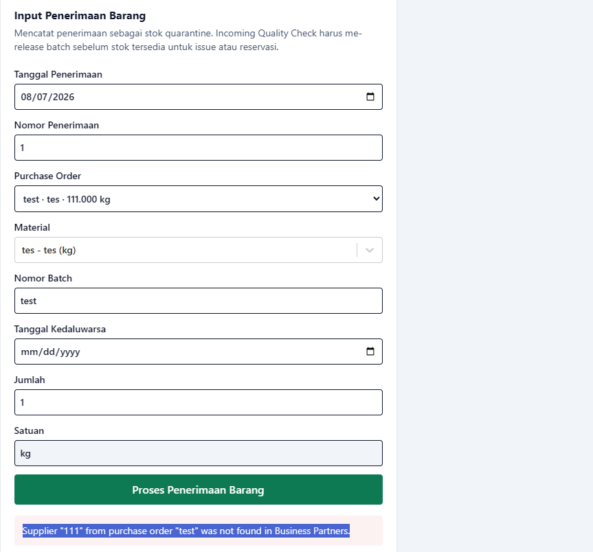
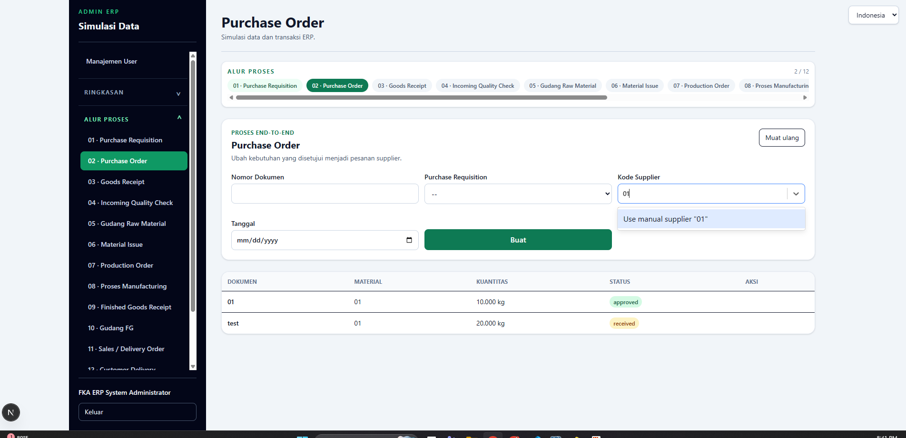
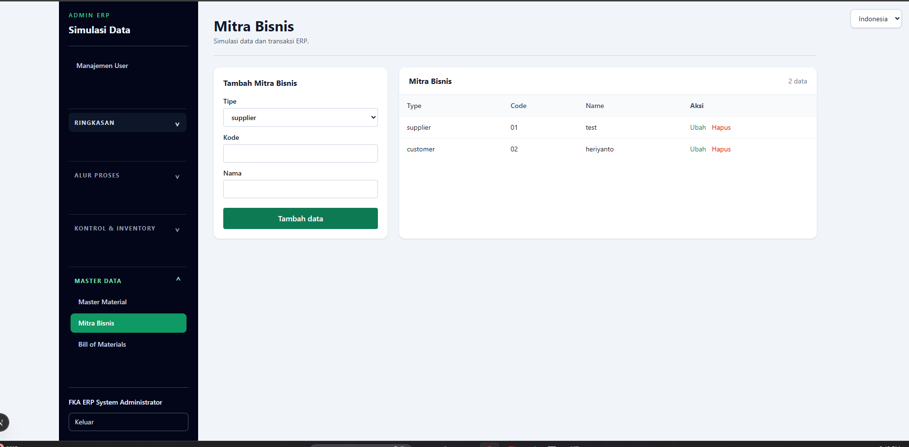

# Prototype Screenshots

The repository contains screenshots captured from the running prototype under `docs/screenshots/`.

## Included evidence

### Goods Receipt Input

Demonstrates the warehouse receipt form with purchase order/material/batch/expiry/quantity/unit inputs and server-side business validation feedback.

### Purchase Order

Demonstrates the end-to-end process navigation and supplier code selection/manual entry in Purchase Order.

### Business Partners

Demonstrates Supplier/Customer master data used by Purchase Order and downstream receiving.

## Recommended additional captures before final submission

If time permits, add `04-current-stock.png`, `05-material-issue.png`, `06-stock-ledger.png`, `07-fifo.png`, and `08-rbac-audit.png` from the final running build. The three screenshots already included satisfy the report's need to show the prototype visually; the additional captures make the mandatory Goods Receipt -> Material Issue -> Current Stock -> Stock Ledger flow easier to verify during review.
