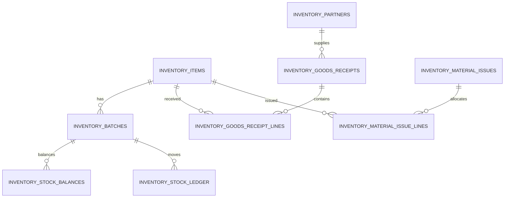

# FKA Inventory Assessment

## Prototype scope

The implemented flow is **Goods Receipt -> Material Issue -> Current Stock -> Stock Ledger**. PostgreSQL is the system of record. Purchase, delivery, full production, accounting, and customs are intentionally documented as future integrations rather than prototype modules.

## Process and controls

| Stage | Owner | Document | Inventory impact | Control |
| --- | --- | --- | --- | --- |
| Purchase requisition / PO | Purchasing | PR, PO | None | Approval and supplier validation |
| Goods receipt | Warehouse + QA | GR | Batch stock increases | Batch uniqueness, quality status |
| Material issue | Warehouse | MI linked to production order | Batch stock decreases | FIFO, released batches only, no negative balance |
| Production | Production | Production order / FG receipt | RM consumption, FG increase | BOM and actual consumption |
| Delivery | Warehouse / Sales | Delivery note | FG decreases | Customer, batch, approval |

Assumption: the prototype uses a single `MAIN/MAIN` warehouse location and released material can be consumed. Quarantined or rejected batches are unavailable.

## Data model



The migration `0016_erp_inventory.sql` defines PostgreSQL types, mandatory fields, PK/FK relationships, unique transaction numbers, unique batch per item, current stock, ledger, and audit trail. Future tables: production orders, BOM headers/lines, finished-goods receipts, delivery headers/lines, users/roles/permissions. Existing Better Auth user tables remain the identity source.

## API examples

`POST /erp/goods-receipts`
```json
{"supplierCode":"SUP-001","documentNumber":"GR-26001","receiptDate":"2026-08-01","idempotencyKey":"a unique client key","lines":[{"itemCode":"RM-001","batchNumber":"RE-26001","expiryDate":"2027-07-31","quantity":25,"qualityStatus":"released"}]}
```

`POST /erp/material-issues`
```json
{"productionOrderNumber":"PO-26001","issueDate":"2026-08-15","idempotencyKey":"a different unique client key","lines":[{"itemCode":"RM-002","quantity":50}]}
```

Success returns `201` and its reference number. Insufficient stock returns `400` with available stock in the message. Replaying an idempotency key returns the original document without moving stock again.

## SQL reports (PostgreSQL)

```sql
-- 3.1 Current Rose Extract stock by batch
SELECT i.code, b.batch_number, b.expiry_date, s.quantity_on_hand, i.unit
FROM inventory_stock_balances s JOIN inventory_batches b ON b.id=s.batch_id JOIN inventory_items i ON i.id=s.item_id
WHERE i.code='RM-001' ORDER BY b.expiry_date;

-- 3.2 Alcohol ledger in August 2026
SELECT l.*, sum(l.quantity_in-l.quantity_out) OVER (PARTITION BY l.batch_id ORDER BY l.transaction_date,l.created_at) AS calculated_balance
FROM inventory_stock_ledger l JOIN inventory_items i ON i.id=l.item_id
WHERE i.code='RM-002' AND l.transaction_date >= DATE '2026-08-01' AND l.transaction_date < DATE '2026-09-01'
ORDER BY l.transaction_date,l.created_at;

-- 3.3 Expiring batches (replace report date as needed)
SELECT i.code,b.batch_number,b.expiry_date,s.quantity_on_hand FROM inventory_batches b JOIN inventory_items i ON i.id=b.item_id JOIN inventory_stock_balances s ON s.batch_id=b.id
WHERE b.expiry_date BETWEEN DATE '2026-08-01' AND DATE '2026-08-01' + INTERVAL '90 days';

-- 3.5 Reconciliation discrepancies
WITH ledger AS (SELECT batch_id,warehouse_id,location_id,sum(quantity_in-quantity_out) qty FROM inventory_stock_ledger GROUP BY 1,2,3)
SELECT s.*,l.qty AS ledger_quantity FROM inventory_stock_balances s JOIN ledger l USING(batch_id,warehouse_id,location_id) WHERE s.quantity_on_hand <> l.qty;
```

Traceability is obtained by joining material issue lines to batches and, in the next phase, linking those lines with the production-order and finished-goods batch.

## FIFO and safety

The material issue endpoint orders eligible batches by expiry, then receipt date. It starts a `SERIALIZABLE` transaction and selects balances `FOR UPDATE`; each decrement asserts `quantity_on_hand >= issued`. A shortage or concurrent update throws, causing rollback of header, lines, ledger, and balances. The unique idempotency key prevents duplicate submission.

For 50 L Alcohol: AL-26001 allocates 40 L first, then AL-26002 allocates 10 L. Remaining AL-26002 is 70 L.

## Architecture, security, operations

Next.js provides the operator UI; Express provides transactional APIs; PostgreSQL holds master and audit data. S3 is not required. RBAC uses the existing authenticated user/role model: administrator manages configuration, warehouse posts GR/MI, production requests work, supervisor approves/reverses, and auditor is read-only. Production should enforce permissions at endpoint level, store actor identity in audit entries, hash passwords through Better Auth, use HTTPS/cookie security, parameterized SQL, access reviews, and reversal documents instead of delete.

Backup proposal: encrypted daily PostgreSQL full backup, continuous WAL/incremental archive, off-site copy, 30-day retention, monthly restore test, RPO 15 minutes and RTO 4 hours. Ransomware recovery restores an isolated clean backup before service re-entry.

Implementation phases: validate masters and migrate deduplicated Excel data; pilot GR/MI with warehouse and QA; UAT/training; add production/BOM/FG/delivery; then accounting, ERP, bonded-zone, and customs integrations through stable APIs/events.

AI disclosure: Codex assisted implementation and documentation. The candidate must review and be able to explain all submitted logic.
